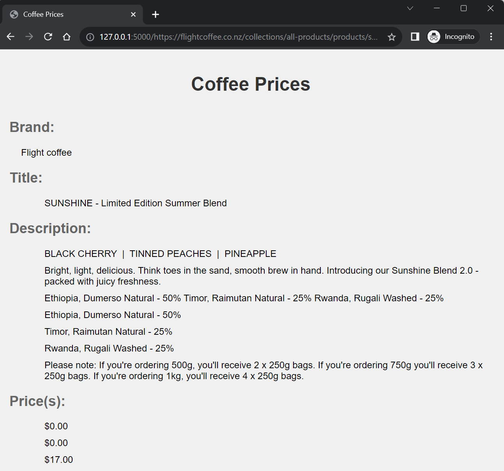

# Coffee Scraper

This is a web scraping project that extracts information about coffee products from a given URL.



## Getting Started

These instructions will get you a copy of the project up and running on your local machine for development and testing purposes.

### Running the Application

To run the application, use the following command:

```bash
python app.py
```

Once the application is running, you can extract data from a specific webpage by passing the URL to the application. To do this, navigate to the following address in your web browser:

`http://localhost:5000/scrape?coffeeUrl=<URL>`

Replace <URL> with the URL of the webpage you want to scrape. For example, if you wanted to scrape the webpage at http://example.com/coffee, you would navigate to http://localhost:5000/scrape?coffeeUrl=http://example.com/coffee.

The application will scrape the specified webpage and display the extracted data.

### Prerequisites

- Python 3
- Flask
- BeautifulSoup

### Installing

1. Clone the repository
2. Install the dependencies

```bash

Built With
Python
Flask
BeautifulSoup
License
This project is licensed under the MIT License - see the LICENSE.md file for details

```
